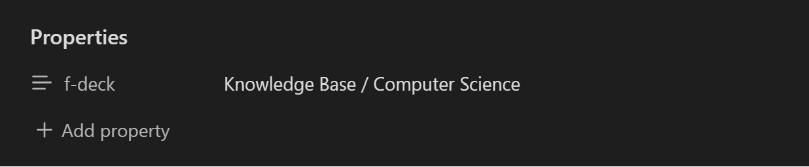

# Obsidian + Mochi Plugin

Welcome to the Obsidian + Mochi Plugin. It's a small plugin I created so that I can write my flashcards where my all my notes are and then be able to revise them in Mochi - a flashcards application I love.

Please note that I am in no way associated with Obsidian or Mochi. This is a third-party plugin.

# Current features

As of right now the plugin doesn't have many features as it's only the first version. Here is what the current version includes:

-   single-line flashcards
    -   full Markdown support
    -   automatic modification/deletion detection
    -   automatic sequential id generation

# The future

I am hoping to add a lot more features in the future, starting with multi-line support. You can request features by sending me an email (contact@hrsdimitrov.com).

# How to use the plugin

## Initial configuration

To start using the plugin, you will need to configure two properties inside the plugin settings. The first one is the default name of the deck that flashcards without a specified deck will go to.

The second one is a Mochi API key used to access your Mochi account. You can create one inside the Mochi application under "Account Settings > API Keys".

## Creating a flashcard

To create a flashcard, you will have to use the "add a single-line flashcard" command by entering it in the Obsidian Command Palette. This will add a flashcard at the current position of your cursor. It will look something like that:

```
  (!#1) Question :: Answer
```

The `(!#1)` combination is used to make flashcards recognizable for the plugin. The number inside the parenthesis is the id of the flashcard. It is automatically generated by the plugin. It will make sure that the ids inside your vault are always sequential.

The `::` combination is used to separate the question from the answer. Make sure to keep your flashcards on a single line only (line overflow doesn't count).

!!! Please not that manually adding flashcards is not supported. It can only happen using the command mentioned above. It's the only way it will be registered in the database.

## Modifying / Deleting a flashcard

Every time you change the text inside a flashcard, the plugin will update the flashcard created in Mochi. If you delete the flashcard text entirely, the plugin will delete the Mochi flashcard. Deleting a file with flashcards will also result in all flashcards inside of it being deleted.

## Specify a flashcard deck

Each Obsidian file is treated as a collection of flashcards. If you want the flashcards in a file to go to different decks than the default one you specified in the plugin settings, you will need to add a page property named `f-deck`. As a text value you will be able to put the name of the deck you want your flashcards to go to.

In the bellow examples, the deck name is changed to be `Knowledge Base / Computer Science`. The `/` indicates a nested Mochi deck. If the deck you specify doesn't exist, it will be automatically created.

Here is an example:



# Storing information

The plugin uses a simple JSON database file (obsidian-mochi-plugin.db) stored in the `.obsidian` folder of your vault to keep track of your flashcards. Even if you delete the plugin, keeping this file will allow you to get back to where you were when you last used it.

# Bug Reports / Needed support

If you want to report a bug or you need help using the Obsidian + Mochi plugin, you can contact me by sending me an email (contact@hrsdimitrov.com).
